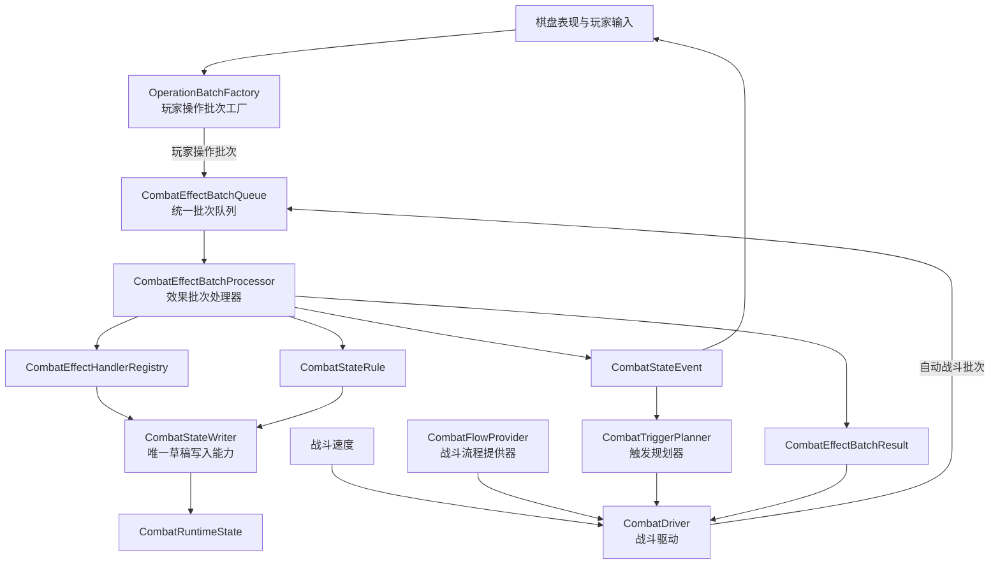
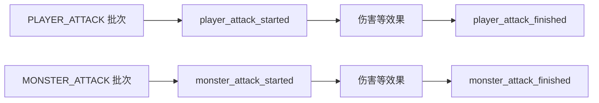
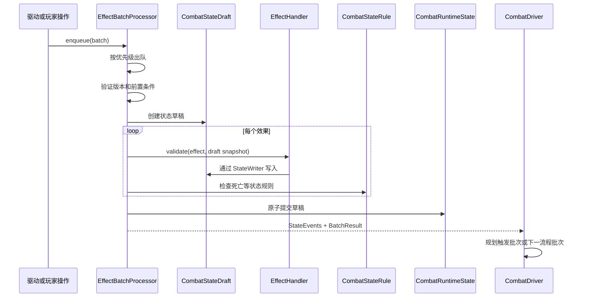
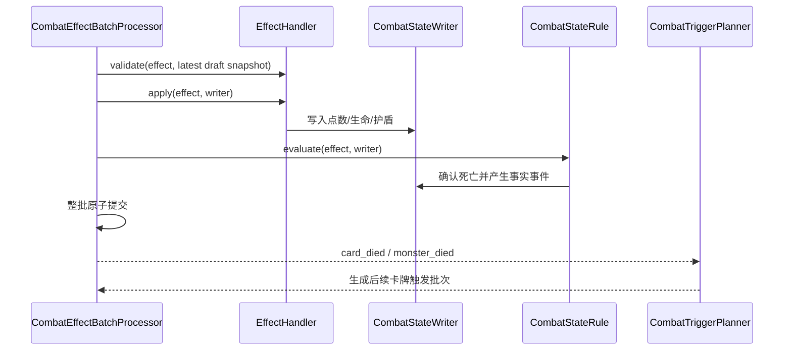
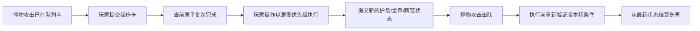

# 战斗批次处理器与战斗驱动架构

日期：2026-08-15  
状态：已确认，战斗协议、运行框架与标准效果库已实现

## 1. 目标

本设计只建立新的战斗协议和运行框架，暂不替换现有 `CombatService`，也暂不制作具体棋盘动画。

核心目标：

1. 由一个战斗驱动决定下一步战斗流程。
2. 由一个效果批次处理器执行所有效果。
3. 效果批次处理器是战斗状态的唯一写入入口。
4. 玩家攻击和怪物攻击使用不同的批次类型和协议事件。
5. 玩家操作卡不经过战斗流程规划，直接生成批次并插入处理器。
6. 战斗速度只影响战斗驱动的推进节奏，不改变数值和事件顺序。
7. 已提交批次不可回滚，未执行批次在执行前使用最新状态重新验证。

## 2. 总体架构



## 3. 模块职责

### 3.1 `CombatDriver`

负责：

- 启动和停止战斗运行循环；
- 从 `CombatFlowProvider` 取得下一个自动战斗批次；
- 在批次完成后将事件交给 `CombatTriggerPlanner`；
- 优先调度派生触发批次，再推进主战斗流程；
- 根据 `CombatBattleClock` 和战斗速度控制自动批次间隔；
- 在需要时等待表现层确认；
- 观察玩家操作造成的新状态并重新推进流程。

不负责：

- 修改卡牌点数、护盾、生命或金币；
- 拆牌链或移除卡牌；
- 直接执行卡牌效果；
- 保存已经计算好的未来伤害结果。

### 3.2 `CombatEffectBatchProcessor`

负责：

- 维护统一优先级队列；
- 在批次出队时验证状态版本、牌链版本和前置条件；
- 在批次草稿中依次执行每个效果；
- 每个效果后执行死亡等状态规则；
- 成功时原子提交草稿；
- 失败时丢弃整个草稿；
- 产生状态事件和批次结果。

处理器不理解完整战斗流程，不决定下一个是玩家攻击还是怪物攻击。

### 3.3 `CombatStateWriter`

效果处理器不能取得正式状态，只能取得由批次处理器创建的 `CombatStateWriter`。

`CombatStateWriter` 提供：

- 设置嵌套状态值；
- 增加数值；
- 修改战斗阶段；
- 标记牌链已经变化；
- 产生状态事件。

正式状态只在整个批次成功后由处理器提交。

### 3.4 `CombatTriggerPlanner`

触发规划器消费已经提交的 `CombatStateEvent`，按以下顺序匹配规则：

1. 事件在批次中的顺序；
2. 触发规则优先级；
3. 规则注册顺序。

触发规划器只生成新的 `CombatEffectBatch`，不修改状态。

### 3.5 玩家操作卡

玩家操作卡的流程是：

```text
拖拽并确定目标
    -> 创建 PLAYER_OPERATION 批次
    -> 直接 enqueue 到 CombatEffectBatchProcessor
    -> 当前原子批次结束
    -> 玩家操作批次按高优先级执行
    -> CombatDriver 观察结果并继续规划
```

第一阶段只提供协议和插入入口。撤退目标预览、碰撞判定和具体操作效果将在后续接入。

## 4. 协议对象

### 4.1 `CombatBatchEffect`

描述批次中的单个效果：

```text
effect_id
效果类型
来源实体 ID
目标实体 ID 列表
参数
标签
```

协议不保存 Node 引用。

### 4.2 `CombatEffectBatch`

描述一个原子结算批次：

```text
batch_id
批次类型
批次来源
优先级
期望状态版本
期望牌链版本
前置条件
有序效果列表
开始事件类型
完成事件类型
```

批次类型包括：

- 战斗开始；
- 战斗结束；
- 玩家攻击；
- 怪物攻击；
- 卡牌触发；
- 玩家操作；
- 流程切换；
- 系统规则。

### 4.3 `CombatStateEvent`

表示已经提交的战斗事实，包含：

```text
事件 ID
事件类型
批次 ID
效果 ID
因果事件 ID
来源实体 ID
目标实体 ID
事件顺序
状态版本
牌链版本
负载数据
```

### 4.4 `CombatEffectBatchResult`

批次结果只有三种状态：

- `COMMITTED`：已经原子提交；
- `CANCELED`：执行前条件不再成立；
- `FAILED`：处理器、效果处理器或状态规则执行失败。

## 5. 玩家攻击与怪物攻击

两种攻击可以复用底层伤害效果处理器，但不能复用顶层批次协议。



这样触发规则可以明确监听玩家攻击或怪物攻击，不需要再检查一个混合攻击事件中的攻击方字段。

## 6. 批次执行时序



当前正在执行的批次不可中断。玩家操作只能在下一个批次边界取得执行权。

## 7. 批次优先级

默认优先级：

```text
SYSTEM_RULE       400
PLAYER_OPERATION  300
CARD_TRIGGER      200
BATTLE_FLOW       100
```

同一优先级按进入队列的先后顺序执行。

战斗驱动不会提前把完整未来流程塞入处理器。它一次只获取和提交一个自动批次，因此玩家操作造成状态变化后，后续主流程天然基于最新快照重新生成。

## 8. 战斗速度

`CombatBattleClock` 使用逻辑时间推进：

```text
本帧逻辑时间 = 本帧真实时间 × 战斗速度
```

战斗速度影响：

- 自动战斗批次的提交间隔；
- 卡牌触发批次之间的间隔；
- 后续表现层推荐动画时长；
- 后续操作窗口的实际持续时间。

战斗速度不影响：

- 效果数值；
- 批次优先级；
- 事件顺序；
- 随机结果；
- 状态版本；
- 原子提交边界。

玩家操作批次是直接输入，不需要等待战斗驱动的自动流程计时器。

## 9. 表现接口

处理器产生事件，表现层消费事件。第一阶段不制作具体动画。

表现层后续可按照事件映射：

```text
点数或护盾变化事件 -> 数字变化动画
card_trigger_started -> 卡牌抖动接口
player_attack_started -> 玩家攻击接口
monster_attack_started -> 怪物攻击接口
chain_changed -> 牌链断开接口
```

`CombatDriver` 已提供：

- `presentation_requested` 信号；
- 推荐表现时长；
- `acknowledge_presentation(batch_id)`；
- 等待表现确认时仍允许玩家操作批次进入处理器。

## 10. 当前实现边界

本阶段已经实现：

- 批次、效果、事件和结果协议；
- 玩家攻击与怪物攻击独立协议；
- 统一优先级批次队列；
- 原子效果批次处理器；
- 效果处理器注册表；
- 状态草稿、唯一写入器和只读快照；
- 状态规则扩展点；
- 触发规划器；
- 可插拔战斗流程提供器；
- 受战斗速度影响的战斗驱动；
- 玩家操作直接插入处理器的入口；
- 表现确认信号和接口边界。

本阶段没有实现：

- 替换现有同步 `CombatService`；
- 具体伤害、死亡、撤退和金币强化效果；
- 操作卡拖拽与目标预览；
- 棋盘动画；
- 遭遇战场景接线；
- 战斗存档与回放。

这些功能应在当前协议稳定后逐步接入，而不是绕过批次处理器直接修改状态。

## 11. 标准战斗状态结构

第二阶段新增 `CombatStateSchema`，将新框架使用的状态路径固定下来。协议状态只保存稳定 ID、数值和普通集合，不保存 `Node`、`Resource`、`CardInstance` 或 `MobInstance` 引用。

```text
player
  entity_id
  hp / max_hp
  shield
  gold
  alive

monster
  entity_id
  hp / max_hp
  shield
  attack
  alive

cards.<card_id>
  entity_id
  points / max_points
  shield
  alive

chain
  card_ids
  detached_card_ids（发生拆链后记录）
```

旧模型与新状态的映射关系为：

| 旧运行时字段 | 新协议字段 |
| --- | --- |
| `CardInstance.current_points` | `cards.<id>.points` |
| `CardInstance.current_armor` | `cards.<id>.shield` |
| `CombatStats.hp` | `player/monster.hp` |
| `CombatStats.defense` | `player/monster.shield` |
| `PlayerData.gold` | `player.gold` |
| `BoardZone.get_combat_card_chain()` | `chain.card_ids` |

当前只建立标准状态结构，尚未用它替换旧 `CombatService`。后续接入时应由独立适配层负责首次装载和提交结果同步，标准效果处理器不得直接依赖旧对象。

`max_points` 表示卡牌初始配置或界面参考值，不是运行期规则强化的硬上限；状态装载和 `modify_card_points` 都会保留高于该值的合法点数。

## 12. 标准效果库

`CombatStandardEffectLibrary` 是默认注册入口，负责组装效果处理器和状态规则。当前标准效果如下：

| 效果类型 | 作用 |
| --- | --- |
| `damage` | 护盾优先吸收，剩余伤害扣除生命或卡牌点数 |
| `modify_shield` | 有符号修改玩家、怪物或卡牌护盾，最低为零 |
| `modify_card_points` | 有符号修改卡牌点数，最低为零 |
| `spend_gold` | 在效果执行前按最新草稿验证金币并扣费 |
| `gain_gold` | 增加玩家金币 |
| `split_chain` | 从目标卡牌处拆开当前牌链 |
| `set_phase` | 通过 `CombatStateWriter` 修改战斗阶段 |

所有处理器遵守以下边界：

1. `validate()` 读取当前最新快照；
2. `apply()` 只能通过 `CombatStateWriter` 修改草稿；
3. 事件的 `source_entity_id` 保留效果来源；
4. 事件的 `target_entity_ids` 保留效果目标；
5. 处理器不决定下一个战斗步骤；
6. 任一效果失败时，整个原子批次不提交。

### 12.1 状态事件与表现接口

标准效果会产生可供棋盘表现层消费的事实事件：

```text
damage_applied
shield_changed
health_changed
card_points_changed
gold_changed
chain_split
card_died
monster_died
```

表现层可以根据这些事件预留接口：

- `shield_changed`：牌面护盾数字变化动画；
- `card_points_changed`：牌面点数变化动画；
- `effect_applied`：卡牌触发抖动；
- `card_died`：卡牌死亡表现；
- `chain_split`：牌链断开表现。

表现层只能消费事件，不能写回战斗状态。

## 13. 死亡规则与触发时序

卡牌死亡和怪物死亡不是伤害处理器的隐藏副作用，而是在每个效果应用后由 `CombatStateRule` 确认：



`card_died` 事件额外保存死亡前的牌链关系：

```text
card_id
chain_index_before
previous_card_id_before
next_card_id_before
```

因此“当前面卡牌死亡时触发”的规则不需要从已经变化的棋盘反推旧关系，只需消费死亡事实事件。

## 14. 玩家操作批次

`CombatOperationBatchFactory` 当前提供两个顶层操作框架：

### 14.1 撤退操作

```text
create_retreat_batch(
  batch_id,
  operation_card_id,
  target_card_id,
  expected_chain_revision
)
```

语义：从目标卡牌之前断开牌链，目标卡牌及其后继卡牌移入 `detached_card_ids`，不再参与后续自动战斗。目标选择由表现/输入层完成；如果拖拽碰撞同时覆盖多张牌，输入层应先选择牌链头部卡牌，再把唯一 `target_card_id` 交给工厂。

### 14.2 金币强化护盾操作

```text
create_gold_shield_batch(
  batch_id,
  operation_card_id,
  target_card_id,
  gold_cost,
  shield_amount,
  expected_chain_revision
)
```

该操作在同一个原子批次中按顺序执行：

```text
spend_gold
  -> modify_shield
```

金币不足、目标离开牌链或牌链版本变化时，整个操作取消，不会出现“已扣金币但未加护盾”的部分提交。

两个工厂都写入：

```text
metadata.preview_mode = target_only
metadata.target_card_id = <目标卡牌 ID>
```

这里只提供目标预览协议，不预测撤退结果、金币结果或强化后的数值动画。

## 15. 玩家操作对已排队结算的影响

玩家操作可以影响已经入队但尚未执行的自动战斗批次，规则如下：



不会发生的行为：

- 不会中断正在执行的原子批次；
- 不会回滚已经提交的批次；
- 不会保存“操作前已经算好的最终伤害”；
- 不会因为表现动画尚未结束而拒绝玩家操作入队。

因此，玩家在操作窗口内增加卡牌护盾后，已经排队但尚未执行的怪物攻击会从新护盾值开始结算。
