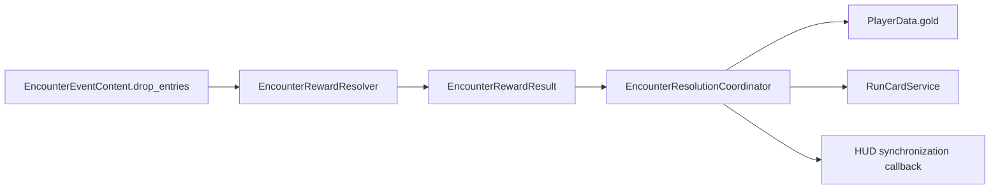

# Encounter Reward Drops Design

**Date:** 2026-08-06  
**Status:** Approved design — pending written-spec review  
**Scope:** Configurable victory drops for monster and Boss encounter events.

## Goal

Allow every encounter event to define its own collection of drop entries. A drop entry is either gold or a card, has an independent probability, and exposes the value needed by its type. A player receives every entry whose roll succeeds after winning that encounter.

This turns normal residual encounters into a small, configurable source of run growth without turning their post-combat flow into a second treasure selection screen.

## Non-goals

- No new reward-selection UI or post-combat modal.
- No new combat outcome or event-interaction route.
- No global rarity, weighted-table, pity, or duplicate-protection system in this iteration.
- No changes to RETREAT, DEFEAT, faith, Boss pursuit, or placement-driven event spawning.

## Chosen Model: Independent Drop Entries

Each `EncounterEventContent` owns `drop_entries: Array[EncounterDropEntry]`. Both `MonsterEventContent` and `BossEventContent` inherit this field because they share the same content base class.

Every entry rolls independently when, and only when, the combat result is `VICTORY`.

| Entry kind | Required configuration | Effect on successful roll |
| --- | --- | --- |
| `GOLD` | `chance`, `gold_amount > 0` | Adds `gold_amount` to current run `PlayerData.gold`. |
| `CARD` | `chance`, non-null `card_data` | Adds one runtime copy of `card_data` to the current run through `RunCardService`. |

A single encounter may therefore guarantee gold and separately offer a rare associated card. A missing or empty drop list means no encounter reward.

### Why independent entries

- Directly expresses “fixed coins + chance at a unique card”.
- Keeps event resources self-contained and level-specific.
- Avoids wrapping an ordinary combat win in treasure-style UI.
- Scales to multiple item entries without special-case logic.

## Runtime Responsibilities

### `EncounterDropEntry` Resource

A new inspector-editable resource with:

- `kind`: `GOLD` or `CARD`.
- `chance`: float in the inclusive range `0.0..1.0`.
- `gold_amount`: positive integer used by `GOLD` entries.
- `card_data`: card resource used by `CARD` entries.
- `validate()`: rejects a non-positive gold amount for gold, a missing card for card, and invalid chance values.

### `EncounterRewardResolver`

A stateless, UI-free resolver that accepts encounter content and a random-number generator, then returns an `EncounterRewardResult` containing:

- total gold awarded;
- ordered list of card resources awarded.

It validates/drop-skips invalid entries defensively. The resolver owns probability rolls but does not mutate player state, board state, or views; it is deterministic when a seeded RNG is injected in tests.

### `EncounterResolutionCoordinator`

The coordinator remains the one place where confirmed combat outcomes mutate run state.

On `VICTORY`, after applying combat state and before resolving/removing the event, it will:

1. Resolve rewards from the event’s `EncounterEventContent`.
2. Add the resulting gold total to `PlayerData.gold`.
3. Grant every resulting card through `RunCardService`.
4. Invoke its existing player-state-change callback once so the crest/HUD refreshes.
5. Resolve/remove/refresh the event exactly as it does today.

On `RETREAT` and `DEFEAT`, it will not resolve or grant drops.

`EncounterResolutionCoordinator.configure()` will receive `PlayerData` as an explicit dependency rather than reaching into `GameManager`, preserving testability and keeping global scene ownership out of the resolver.

### Full Hand Rule

A rewarded card must not disappear because the hand reached its normal size limit. `RunCardService` will expose an opt-in overflow-safe grant path used only by confirmed encounter rewards. It temporarily permits the new owned card to enter the hand, then restores the normal configured hand capacity. The card remains in the hand; subsequent card placement naturally brings the visible count back within the normal limit.

This matches the existing guide-card recovery principle: acquired player-owned cards are never silently discarded because of capacity.

## Ribwood Initial Data

Normal residual cards will be authored as ordinary Ribwood `CardData` resources, then referenced only by the residual that can drop them.

Initial proposed configuration:

| Encounter | Guaranteed drop | Optional card drop | Purpose |
| --- | --- | --- | --- |
| Marrow Rat Echo | 8 gold at 100% | 20% Rat-specific low-power card | First-win feedback and a light build hook. |
| Fallen Rib Wolf Echo | 12 gold at 100% | 35% Wolf-specific defensive/counter card | Higher-risk encounter yields a stronger build hook. |
| White-Horn Hart Boss | Empty by default | Empty by default | Avoids duplicating the dedicated Boss/clear reward layer. |

Exact card resources, names, stats, and art are outside this mechanics task unless they already exist as suitable Ribwood cards. The implementation will configure existing appropriate Ribwood cards if available; otherwise the drop system and gold configuration still land independently.

## Error Handling and Ordering

- Empty drop lists are valid.
- Invalid resource entries do not block an encounter victory; they are skipped and report an error in validation/tests.
- A failed card grant after an overflow-safe attempt logs an error but does not undo combat victory or gold already awarded.
- Reward rolls occur once at confirmed combat settlement. Reopening/refreshing a resolved event cannot roll again because the event is already resolved.
- Boss removal and event display refresh follow the existing paths after reward application.

## Test Plan

1. `EncounterDropEntry` validation covers both kinds and invalid values.
2. `EncounterRewardResolver` covers 0%, 100%, and seeded probabilistic rolls; verifies multiple independent entries can award together.
3. `EncounterResolutionCoordinator` tests:
   - victory grants configured gold and card;
   - RETREAT and DEFEAT grant nothing;
   - empty drops leave run rewards unchanged;
   - reward card is retained when hand is full;
   - Boss victory can use the same pipeline without changing Boss cleanup.
4. Ribwood resource tests verify configured entries reference valid cards and intended gold/chance values.
5. Full Godot editor scan plus the complete `tests/*.gd` suite run in a fresh user-data directory.

## Acceptance Criteria

- A level designer can add one or more monster/Boss drop entries in `.tres` without code edits.
- Gold and cards each support independent probabilities.
- A single victory can grant both gold and one or more cards.
- Drops are never granted for RETREAT or DEFEAT.
- Encounter-specific cards are not lost when normal hand capacity is full.
- The existing Boss, event, combat, faith, and exploration workflows retain their current behavior.