# 有状态战斗会话与战斗操作卡设计

> **架构更新（2026-08-15）：** 本文中的多队列 `CombatSession` 方案已由“战斗驱动 + 统一效果批次处理器”方案取代。当前实现与后续接入以 `docs/design/2026-08-15-combat-batch-driver-architecture.md` 为准。


**日期：** 2026-08-14
**状态：** 已确认，等待文档复核
**范围：** 单怪物牌链战斗的结算协议、触发时序、战斗速度、棋盘表现与战斗中操作卡
**替代范围：** 本设计替代 `2026-08-02-combat-event-ui-design.md` 中“一次性计算完整 CombatResult 后只读回放”的战斗执行方式；旧文档中仍适用的结果展示和事件接入约束可在迁移期间保留。

## 1. 背景

当前 `CombatService2.resolve_encounter()` 会一次性计算完整场战斗，将玩家攻击、怪物反击、触发效果和最终状态提前写入 `CombatResult.steps`。`CombatEventView` 只负责回放已经完成的结果。

这种模型不能可靠支持以下需求：

- 玩家在战斗动画期间使用卡牌改变尚未发生的结算；
- 玩家攻击与怪物攻击成为两个独立原子事件；
- 卡牌在战斗开始、特定卡牌触发完成、前方卡牌死亡等精确时机触发；
- 撤退、支付金币增加护盾等多种战斗操作卡；
- 使用棋盘和棋盘上的真实卡牌表现战斗过程；
- 调整“战斗速度”，同步改变后续原子事件的实际结算节奏、动画节奏和玩家操作时间；
- 在不回滚已发生状态的前提下，让玩家操作影响已排队但尚未结算的请求。

因此战斗必须从“一次性求值 + 结果回放”改为“有状态会话 + 原子事件推进”。

## 2. 目标

本次重构的目标是：

1. 使用 `CombatSession` 保存进行中的战斗状态，每次只结算一个原子事件；
2. 使用明确的数据协议描述命令、触发、意图、领域事件、表现批次和最终结果；
3. 将玩家攻击和怪物攻击拆分为不同事件批次，禁止在同一个效果草案或批次中执行；
4. 使用显式触发队列替代字符串式钩子和同步递归触发；
5. 支持战斗开始、攻击完成、特定卡牌触发完成、卡牌耗尽、前方卡牌耗尽等触发点；
6. 通过通用战斗操作协议支持撤退、金币强化护盾以及未来其他操作卡；
7. 战斗拖拽只预览目标卡牌，不预演最终数值或结构结果；
8. 让战斗速度控制下一次原子结算的现实时间间隔，并同步棋盘表现；
9. 使用棋盘上的卡牌和怪物节点播放战斗，保留抖动、点数变化、护盾变化、死亡和牌链变化等表现接口；
10. 让已提交的战斗事实不可变，同时允许玩家操作影响所有尚未提交的未来结算。

## 3. 非目标

本次首轮实现不包含：

- 具体卡牌抖动、数字跳动、牌链断开或伤害特效；
- 撤退退出牌段的拖拽预览；
- 护盾增量、费用支付后余额或最终伤害的效果预测；
- 多怪物目标选择；
- 网络同步和跨设备战斗回放；
- 完全不可变的事件溯源存储；
- 对所有旧卡牌规则的一次性重写；迁移应允许旧规则逐步接入新触发协议；
- 对无关棋盘、商店、地图或卡牌系统的重构。

## 4. 核心设计原则

### 4.1 不预计算未来

战斗系统不得在开战时计算完整 `CombatResult`。`CombatSession` 只能在调度器允许推进时调用一次 `advance_one_event()`，并提交一个原子结果。

### 4.2 原子事件不可回滚

已经提交的攻击、护盾变化、点数变化或牌链变化是战斗事实。后续玩家操作不能修改这些事实，只能影响尚未结算的请求。

### 4.3 队列保存请求，不保存未来结果

触发队列和命令队列保存“将来尝试执行什么”，不能提前保存最终伤害、护盾或生命值。请求出队时使用最新战斗状态重新验证和计算。

### 4.4 规则与表现解耦

战斗规则只产生意图和协议事件，不直接调用棋盘动画。棋盘表现只消费 `CombatEventBatch`，不计算伤害、不扣金币、不拆牌链。

### 4.5 稳定 ID 替代 Node 引用

跨层协议必须使用稳定实体 ID。Node 只存在于表现层的实体映射中，不得成为 `CombatCommand`、`CombatTriggerRequest` 或 `CombatEventBatch` 的业务身份。

### 4.6 战斗速度控制推进，不改变规则

战斗速度同时控制原子事件间隔和表现速度，但不得改变伤害、触发顺序、随机结果或原子边界。

## 5. 总体架构

```mermaid
flowchart TB
    subgraph Definitions["配置与规则定义"]
        CardRule["CardRule"]
        TriggerSpec["CombatTriggerSpec"]
        EffectDefinition["CombatEffectDefinition"]
        OperationDefinition["CombatOperationDefinition"]
        TargetSpec["CombatTargetSpec"]
        CostSpec["CombatCostSpec"]
        DispositionSpec["CardDispositionSpec"]
        CardRule --> TriggerSpec
        CardRule --> EffectDefinition
        OperationDefinition --> TargetSpec
        OperationDefinition --> CostSpec
        OperationDefinition --> DispositionSpec
    end

    subgraph Input["棋盘输入与目标选择"]
        Board["Board / BoardZone"]
        Dragger["DraggerLayer"]
        TargetResolver["CombatTargetResolver"]
        TargetPreview["CombatTargetPreviewPort"]
        OperationCommand["PlayCombatOperationCommand"]
        Board --> Dragger
        Dragger --> TargetResolver
        TargetResolver --> TargetPreview
        Dragger --> OperationCommand
    end

    subgraph Orchestration["节奏与编排"]
        EncounterCoordinator["EncounterCombatCoordinator"]
        SpeedController["CombatSpeedController"]
        Scheduler["CombatScheduler"]
        AdvanceGate["CombatAdvanceGate"]
        OperationWindow["CombatOperationWindow"]
        PresentationCoordinator["CombatPresentationCoordinator"]
        SpeedController --> Scheduler
        SpeedController --> PresentationCoordinator
        Scheduler --> AdvanceGate
        OperationWindow --> AdvanceGate
        PresentationCoordinator --> AdvanceGate
    end

    subgraph Domain["战斗领域"]
        Session["CombatSession"]
        State["CombatState"]
        PhaseMachine["CombatPhaseMachine"]
        CommandQueue["CombatCommandQueue"]
        TriggerQueue["CombatTriggerQueue"]
        RuleDispatcher["CombatRuleDispatcher"]
        OperationResolver["CombatOperationResolver"]
        EffectResolver["CombatEffectResolver"]
        TriggerCollector["CombatTriggerCollector"]
        TerminalEvaluator["CombatTerminalEvaluator"]
        Session --> State
        Session --> PhaseMachine
        Session --> CommandQueue
        Session --> TriggerQueue
        CommandQueue --> OperationResolver
        TriggerQueue --> RuleDispatcher
        OperationResolver --> EffectResolver
        RuleDispatcher --> EffectResolver
        EffectResolver --> State
        EffectResolver --> TriggerCollector
        TriggerCollector --> TriggerQueue
        EffectResolver --> TerminalEvaluator
    end

    subgraph Protocol["纯数据协议"]
        Command["CombatCommand"]
        Trigger["CombatTriggerRequest"]
        Intent["CombatIntent"]
        DomainEvent["CombatDomainEvent"]
        Batch["CombatEventBatch"]
        CommandResult["CombatCommandResult"]
        Result["CombatResult"]
    end

    subgraph Presentation["棋盘表现"]
        BoardCombatView["BoardCombatView"]
        CardPresentation["CardCombatPresentation"]
        MonsterPresentation["MonsterCombatPresentation"]
        StatPresentation["CardStatPresentation"]
        ChainPresentation["ChainPresentation"]
        FeedbackPresentation["CommandFeedbackPresentation"]
        PresentationCoordinator --> BoardCombatView
        BoardCombatView --> CardPresentation
        BoardCombatView --> MonsterPresentation
        BoardCombatView --> StatPresentation
        BoardCombatView --> ChainPresentation
        BoardCombatView --> FeedbackPresentation
    end

    subgraph Commit["最终提交"]
        ResultCommitter["CombatResultCommitter"]
        BoardTransaction["BoardTransaction"]
        ResourceGateway["PlayerResourceGateway"]
        ZoneGateway["CardZoneGateway"]
        MonsterGateway["MonsterStateGateway"]
        RewardResolver["RewardResolver"]
        ResultCommitter --> BoardTransaction
        ResultCommitter --> ResourceGateway
        ResultCommitter --> ZoneGateway
        ResultCommitter --> MonsterGateway
        ResultCommitter --> RewardResolver
    end

    EncounterCoordinator --> Session
    Scheduler -->|"advance_one_event"| Session
    OperationCommand --> Command
    Command --> CommandQueue
    Session --> Trigger
    Trigger --> TriggerQueue
    OperationResolver --> Intent
    RuleDispatcher --> Intent
    Intent --> EffectResolver
    EffectResolver --> DomainEvent
    DomainEvent --> Batch
    Session --> Batch
    Batch --> PresentationCoordinator
    PresentationCoordinator -->|"presentation_ready"| AdvanceGate
    Dragger -->|"interaction hold"| OperationWindow
    Session --> Result
    Result --> ResultCommitter
```



## 6. 核心组件

### 6.1 CombatSession

`CombatSession` 是单场战斗的唯一领域状态机，负责：

- 保存玩家、怪物、活动牌链和战斗资源快照；
- 保存当前阶段、活动卡牌、触发队列和命令队列；
- 每次推进一个原子事件；
- 将规则产生的意图交给统一解析器；
- 产生不可变 `CombatEventBatch`；
- 判断胜利、失败、撤退和无可用卡牌等终止状态；
- 生成最终 `CombatResult`。

它不负责：

- 等待现实时间；
- 读取鼠标位置；
- 播放动画；
- 直接修改棋盘 Node；
- 直接写入玩家持久数据。

### 6.2 CombatScheduler

`CombatScheduler` 根据战斗速度和三重门控决定何时调用 `CombatSession.advance_one_event()`。

推进条件为：

```text
can_advance =
    settlement_delay_ready
    AND presentation_ready
    AND interaction_ready
```

在满足推进条件后，调度器仍需遵守领域优先级：先检查终止状态，再处理玩家命令，然后处理触发队列，最后进入下一阶段行为。

### 6.3 CombatSpeedController

`CombatSpeedController` 是战斗时钟的唯一来源，负责：

- 保存 `speed_multiplier`；
- 根据基础事件间隔计算实际结算间隔；
- 通知调度器调整当前和后续等待；
- 通知表现协调器同步动画速度；
- 支持战斗中实时调整速度。

建议计算方式：

```text
effective_interval = base_settlement_interval / speed_multiplier
```

速度只改变现实时间节奏，不改变事件顺序和数值规则。

### 6.4 CombatPresentationCoordinator

表现协调器消费 `CombatEventBatch`，将实体 ID 映射到棋盘卡牌或怪物节点，并调用表现接口。必要表现完成后发送 `presentation_ready(batch_id)`。

### 6.5 CombatAdvanceGate

推进门聚合：

- 战斗时钟是否到期；
- 当前表现是否完成；
- 玩家是否仍在拖拽操作卡。

已经开始的合法拖拽会持有 interaction hold。即使动画和结算间隔结束，也必须等待玩家松手或取消后才能推进。

## 7. 战斗协议

### 7.1 CombatCommand

外部输入命令的公共字段：

```text
CombatCommand
├── command_id
├── command_type
├── submitted_batch_id
├── submitted_sequence
└── source_entity_id
```

战斗操作卡命令：

```text
PlayCombatOperationCommand
├── command_id
├── operation_id
├── operation_card_instance_id
├── target_entity_id
├── submitted_batch_id
└── submitted_sequence
```

命令只使用稳定 ID，不携带 Node。

### 7.2 CombatTriggerRequest

```text
CombatTriggerRequest
├── trigger_id
├── trigger_type
├── cause_event_id
├── source_entity_id
├── target_entity_id
├── cause_snapshot
├── validation_policy
├── priority
├── enqueue_sequence
├── chain_position
└── rule_order
```

`cause_snapshot` 保存不可变历史事实，例如本次实际伤害、死亡卡牌 ID 或完成触发的规则 ID。来源和目标是否仍有效，在请求出队时按 `validation_policy` 重新验证。

### 7.3 CombatIntent

规则和操作定义只能产生意图，不能直接修改状态。

```text
CombatIntent
├── intent_id
├── intent_type
├── source_entity_id
├── target_entity_ids
├── payload
├── cause_event_id
└── command_id
```

意图分为：

- `CombatEffectIntent`：伤害、治疗、护盾、点数、金币等数值变化；
- `CombatStructuralIntent`：切断牌链、移动卡牌、消耗操作卡、结束战斗等结构变化。

### 7.4 CombatDomainEvent

领域事件描述已经提交的事实，例如：

- `PLAYER_ATTACK_FINISHED`；
- `MONSTER_ATTACK_FINISHED`；
- `CARD_POINTS_CHANGED`；
- `CARD_SHIELD_CHANGED`；
- `CARD_DEPLETED`；
- `CARD_TRIGGER_FINISHED`；
- `CHAIN_STRUCTURE_CHANGED`；
- `COMBAT_OPERATION_RESOLVED`。

领域事件可以被 `CombatTriggerCollector` 转换为新的触发请求。

### 7.5 CombatEventBatch

每个批次只表达一个主要原子行为：

```text
CombatEventBatch
├── batch_id
├── sequence
├── batch_type
├── cause
├── source_entity_id
├── target_entity_ids
├── state_changes
├── domain_events
├── parent_batch_id
├── command_id
├── trigger_id
└── terminal_state
```

状态变化包含：

```text
CombatStateChange
├── entity_id
├── property
├── before_value
├── after_value
└── delta
```

允许的主要批次包括：

- `COMBAT_START`；
- `CARD_TRIGGER`；
- `PLAYER_ATTACK`；
- `MONSTER_ATTACK`；
- `COMBAT_OPERATION`；
- `CARD_DEPLETED`；
- `CHAIN_CHANGED`；
- `COMBAT_END`。

禁止创建 `PLAYER_ATTACK_AND_MONSTER_ATTACK` 等复合攻击批次。

### 7.6 CombatCommandResult

```text
CombatCommandResult
├── command_id
├── accepted
├── reason_key
├── source_entity_id
└── target_entity_id
```

命令失败不得产生部分状态写入。

## 8. 战斗阶段

建议阶段枚举：

```text
INITIALIZING
COMBAT_START
CARD_BEGIN
PLAYER_ATTACK
AFTER_PLAYER_ATTACK
MONSTER_ATTACK
AFTER_MONSTER_ATTACK
CARD_END
COMBAT_ENDING
COMPLETED
```

基础牌链处理顺序保持从头牌向根牌推进。每张活动卡的主流程为：

```text
CARD_BEGIN
→ 卡牌开始触发
→ PLAYER_ATTACK
→ 立即终止检查
→ 玩家操作命令
→ 玩家攻击后触发
→ MONSTER_ATTACK
→ 怪物攻击后触发
→ 卡牌耗尽和前方卡牌耗尽触发
→ CARD_END
→ 下一张卡牌
```

任意触发和操作仍被拆为单独原子事件。

## 9. 玩家攻击与怪物攻击

玩家攻击与怪物攻击必须严格分开：

1. `PLAYER_ATTACK` 只计算玩家本次攻击；
2. 提交玩家攻击状态变化并产生独立批次；
3. 等待战斗时钟、表现和玩家交互；
4. 处理玩家操作和玩家攻击后触发；
5. 若怪物已经死亡，直接进入胜利结算；
6. 若战斗仍进行，才允许产生 `MONSTER_ATTACK`；
7. `MONSTER_ATTACK` 只计算怪物本次攻击，并产生另一个独立批次。

不得在一个 `CombatEffectDraft`、Intent 集合或 EventBatch 中同时执行双方攻击。

## 10. 触发系统

### 10.1 触发类型

首轮协议至少支持：

```text
COMBAT_STARTED
CARD_TURN_STARTED
PLAYER_ATTACK_STARTED
PLAYER_ATTACK_FINISHED
MONSTER_ATTACK_STARTED
MONSTER_ATTACK_FINISHED
CARD_TRIGGER_STARTED
CARD_TRIGGER_FINISHED
SPECIFIC_CARD_TRIGGER_FINISHED
CARD_POINTS_CHANGED
CARD_SHIELD_CHANGED
CARD_DEPLETED
FRONT_CARD_DEPLETED
CHAIN_STRUCTURE_CHANGED
COMBAT_OPERATION_RESOLVED
COMBAT_ENDING
COMBAT_ENDED
```

`SPECIFIC_CARD_TRIGGER_FINISHED` 必须携带完成触发的卡牌实例 ID 和规则/效果 ID，使其他规则可以精确匹配。

`FRONT_CARD_DEPLETED` 由牌链关系解析：当某卡耗尽时，为其根部方向直接相邻卡生成“前方卡牌耗尽”请求。请求保存死亡卡 ID 和观察者卡 ID，避免使用模糊位置字符串。

### 10.2 队列而非同步递归

规则执行产生的新触发必须追加到 `CombatTriggerQueue`，不得在当前规则调用栈中同步递归执行。这样可以保证确定性排序、插入玩家命令并检测异常循环。

### 10.3 排序

触发请求排序键：

```text
priority
→ enqueue_sequence
→ chain_position
→ rule_order
→ trigger_id
```

原子边界的整体处理优先级：

```text
0. 提交当前原子事件的强制状态稳定
1. 检查已经成立的立即终止条件
2. 处理已提交的玩家操作命令
3. 处理触发队列
4. 执行下一阶段行为
```

这意味着当前攻击已经使玩家或怪物死亡时，终止结果优先，不能通过随后提交的操作回滚死亡。战斗未终止时，玩家操作优先于尚未开始的普通触发和下一次攻击。

### 10.4 触发存活策略

```text
REQUIRE_SOURCE_ACTIVE
REQUIRE_SOURCE_PRESENT
ALLOW_SOURCE_DEPLETED
REQUIRE_TARGET_ACTIVE
REQUIRE_TARGET_PRESENT
RETARGET_ON_RESOLVE
CANCEL_ON_COMBAT_END
EXECUTE_DURING_COMBAT_END
```

普通持续效果默认要求来源和目标仍有效，并在战斗结束时取消。死亡效果可以允许来源已经耗尽。只有明确标记的战斗结束效果可以在 `COMBAT_ENDING` 执行。

### 10.5 防循环

会话必须记录触发序号和因果链，并设置单场战斗或单原子链的安全上限。超过上限时停止继续入队，产生明确错误结果，而不是卡死主线程。

## 11. 已排队请求与玩家操作

玩家操作会影响所有尚未提交的未来结算，但不能影响已经提交的战斗事实。

### 11.1 已提交事件

已经提交的玩家攻击、怪物攻击或数值变化不可回滚。即使对应动画仍在播放，后续操作也只能在当前原子事件结束后生效。

### 11.2 尚未结算请求

触发、攻击计划和操作命令出队时必须读取最新状态。例如玩家在怪物攻击结算前增加目标护盾，怪物攻击应读取增加后的护盾。

### 11.3 历史事实与当前状态

历史原因来自 `cause_snapshot`，不能被后续操作改变；当前目标合法性和状态使用执行时快照。

例如“获得等于 A 本次实际伤害的护盾”：本次实际伤害固定为历史值，但接受护盾的目标必须在执行时仍然有效。

### 11.4 多条操作命令

命令按 `submitted_sequence` 逐条处理，每条命令独立验证并产生独立批次。前一条命令可以使后一条失效：

- 前一条扣费导致后一条金币不足；
- 前一条移除目标导致后一条目标失效；
- 前一条改变牌链导致后一条目标不再属于活动牌链；
- 前一条撤退结束战斗，剩余命令全部取消。

系统不得自动为失效的固定目标选择替代卡牌。

## 12. 通用战斗操作卡

### 12.1 CombatOperationDefinition

```text
CombatOperationDefinition
├── operation_id
├── allowed_windows
├── source_spec
├── target_spec
├── cost_spec
├── source_card_disposition
├── validation_policy
└── build_intents(context, source, target)
```

拖拽系统只识别卡牌是否提供操作定义，不识别“撤退卡”或“护盾卡”具体类型。

首轮操作卡来源默认要求：

- 卡牌实例位于棋盘；
- 卡牌尚未被消耗；
- 卡牌当前没有作为另一个原子事件的活动来源；
- 是否允许活动牌链成员作为操作来源由 `source_spec` 明确配置，撤退和护盾强化首版默认排除正在结算的活动牌链成员。

### 12.2 CombatTargetSpec

目标规则至少支持：

- 目标种类；
- 是否必须存活；
- 是否必须位于活动牌链；
- 是否允许根牌或头牌；
- 固定目标或执行时重选目标；
- 重叠时的选择优先级。

牌链目标同时重叠时统一选择更靠近头牌的卡牌。

### 12.3 CombatCostSpec

费用协议不能写死为金币，应支持资源类型和数量。费用只由会话在原子边界验证与扣除，UI 不得直接支付。

### 12.4 CardDispositionSpec

成功使用后的来源卡处理策略：

```text
CONSUME
DISCARD
RETURN_TO_HAND
KEEP_ON_BOARD
CUSTOM
```

失败时不应用 disposition，卡牌恢复拖拽前位置。

### 12.5 原子性

操作验证、扣费、效果和来源卡处理必须形成一个事务：全部成功或全部不写入。失败时不扣费、不消耗卡牌、不改变目标、不修改牌链。

## 13. 目标预览

战斗拖拽期间只生成：

```text
CombatTargetPreview
├── operation_card_instance_id
├── target_entity_id
├── target_kind
├── is_targetable
├── highlight_style_key
└── invalid_reason_key
```

目标预览允许显示当前命中的目标和目标是否合法，但不得包含：

- 撤退后切下的牌段；
- 预计增加的护盾；
- 预计扣除的金币；
- 预计伤害；
- 预计胜负；
- 使用后来源卡去向。

具体高亮动画不在首轮范围内，只保留 `preview_operation_target()` 和 `clear_operation_target_preview()` 接口。

## 14. 战斗操作窗口

战斗事件表现期间打开 `CombatOperationWindow`。玩家只能在窗口打开时开始拖动合法操作卡。

状态：

```text
OPEN
HOLDING
CLOSED
```

若玩家已在 `OPEN` 期间开始拖拽，窗口取得 interaction hold。即使动画和战斗间隔结束，也必须等待玩家松手或取消。拖拽结束后关闭新的操作入口并允许调度器继续。

玩家在目标上松手后只是提交命令。命令必须等待当前原子事件完成，并在下一个原子边界重新验证。

## 15. 战斗速度

战斗速度不是单纯的播放倍率，而是统一控制结算推进和表现节奏的战斗时钟。

```text
CombatSpeedSettings
├── speed_multiplier
├── base_settlement_interval
└── apply_immediately
```

它影响：

- 下一原子事件的结算间隔；
- 卡牌、数字、怪物和牌链表现速度；
- 玩家开始战斗操作的现实时间窗口；
- 玩家攻击、触发、操作和怪物攻击之间的现实时间间隔。

它不影响：

- 伤害和护盾数值；
- 事件和触发排序；
- 随机结果；
- 原子事件边界；
- 已经提交的战斗事实。

战斗中改变速度时，已经提交的原子事件不重算；新速度立即影响当前剩余等待、当前可调速表现和后续事件。已开始的拖拽继续受 interaction hold 保护。

## 16. 撤退操作

假设牌链：

```text
根牌 → B → A → C → 头牌
```

撤退卡目标 A 时，拖拽期间只高亮 A。成功执行后：

```text
保留：根牌 → B
退出并返回手牌：A → C → 头牌
```

撤退操作产生：

```text
CONSUME_OPERATION_CARD
CUT_CHAIN_FROM_TARGET(A)
RETURN_CUT_SEGMENT_TO_HAND
END_COMBAT(RETREAT)
```

撤退结算规则：

- 保留双方已经发生的伤害和状态变化；
- 结算已经耗尽的卡牌；
- 保留根部方向剩余牌链在棋盘；
- A 到头牌方向的切下牌段返回手牌；
- 成功发动的撤退卡被消耗；
- 不发放胜利奖励；
- 怪物事件留在棋盘并强化一次；
- 清除尚未开始的普通触发、攻击计划和剩余操作命令；
- 不开始后续怪物攻击。

如果目标在正式执行前已经失效，则拒绝撤退，不消耗撤退卡。

## 17. 金币强化护盾操作

示例操作：支付 3 金币，为目标活动牌链卡牌增加 5 点护盾。

执行时产生：

```text
SPEND_CURRENCY(GOLD, 3)
ADD_CARD_SHIELD(target, 5)
APPLY_SOURCE_CARD_DISPOSITION
```

操作出队时重新检查金币和目标。若前一条命令已消耗金币或移除目标，则本命令拒绝。成功后产生独立 `COMBAT_OPERATION` 批次，棋盘表现层通过 `CARD_SHIELD_CHANGED` 更新牌面数字。

拖拽预览只高亮目标，不显示 `+5` 或支付后的金币余额。

## 18. 棋盘表现接口

首轮保留以下接口，具体动画后续实现：

```text
CombatPresentationPort
├── present_batch(batch, combat_speed)
├── play_card_trigger(card_id, context)
├── play_card_stat_change(card_id, changes)
├── play_card_depleted(card_id, context)
├── play_player_attack(source_id, target_id, changes)
├── play_monster_attack(source_id, target_id, changes)
├── play_chain_changed(change_data)
├── preview_operation_target(target_id, style_key)
├── clear_operation_target_preview()
├── play_command_rejected(command_result)
└── notify_presentation_ready(batch_id)
```

所有方法由 `CombatPresentationCoordinator` 调用。表现端不得修改战斗状态。

## 19. 最终结果与持久化

战斗开始时将玩家资源、怪物状态和活动牌链复制或映射为会话状态。战斗期间所有变化先进入 `CombatState`。

终止后 `CombatResult` 至少包含：

- 战斗结果（`outcome`）；
- 玩家和怪物最终状态；
- 卡牌点数与护盾最终状态；
- 耗尽卡牌；
- 牌链结构变化；
- 手牌、弃牌和消耗变化；
- 玩家资源变化量（`delta`）；
- 怪物强化或移除结果；
- 奖励信息；
- 已提交事件摘要。

`CombatResultCommitter` 负责一次性应用到真实棋盘和玩家数据。UI 和操作卡规则不能直接写持久数据。

## 20. 错误处理

必须覆盖：

- 操作来源卡不存在或正在被其他事件使用；
- 目标已经死亡、离开活动牌链或 ID 无法解析；
- 金币等费用不足；
- 命令提交批次已经过期；
- 战斗已经终止；
- 表现 ACK 重复、乱序或引用未知批次；
- 触发循环超过安全上限；
- 规则返回非法 Intent；
- 结构操作产生非法牌链；
- 表现 Node 缺失但领域状态有效。

命令类错误返回 `CombatCommandResult`，不写入部分状态。领域协议错误应终止当前会话并产生可诊断错误，而不是静默继续。表现节点缺失不得改变领域结算结果，但应记录错误并允许安全完成批次。

## 21. 迁移策略

迁移应分阶段完成，避免一次性破坏现有战斗：

1. 引入纯数据协议、稳定 ID 和会话测试夹具；
2. 将现有 `CombatEffectResolver` 接入 Intent 解析接口；
3. 实现 `CombatSession` 和单原子事件推进；
4. 首先拆分玩家攻击与怪物攻击；
5. 引入触发队列并适配现有 CardRule；
6. 将遭遇流程从一次性 `CombatResult` 改为 Session 驱动；
7. 接入棋盘表现协调器和 ACK；
8. 接入战斗速度和三重推进门；
9. 接入通用战斗操作卡、目标查询和命令队列；
10. 实现撤退操作；
11. 用金币护盾操作作为第二个通用性验收样例；
12. 删除或隔离不再使用的一次性完整战斗回放路径。

迁移期间不得重置或覆盖现有 Board、Zone 和 DraggerLayer 的无关改动。

## 22. 测试策略

遵循 TDD，每个行为先写失败测试，再实现最小功能。

### 22.1 协议测试

- 命令、触发、意图、领域事件和批次可独立构造；
- 协议只包含稳定 ID，不包含 Node；
- 状态变化正确保存变更前/后值（`before`/`after`）；
- 玩家攻击批次和怪物攻击批次不能合并。

### 22.2 会话时序测试

- 战斗开始触发先于第一张卡攻击；
- 玩家攻击独立提交；
- 玩家攻击后效果完成后才允许怪物攻击；
- 怪物死亡时跳过怪物攻击；
- 每次 `advance_one_event()` 最多提交一个主要原子行为；
- 表现未 ACK 时不能继续推进。

### 22.3 触发测试

- `CARD_TRIGGER_FINISHED` 和 `SPECIFIC_CARD_TRIGGER_FINISHED` 正确携带因果数据；
- 前方卡牌耗尽只通知正确的相邻观察卡；
- 触发按 priority、sequence、chain position 和 rule order 确定性排序；
- 新触发追加到队列，不同步递归；
- 来源死亡策略和目标失效策略正确；
- 触发循环上限可以安全终止异常规则。

### 22.4 玩家操作影响队列测试

- 护盾强化会影响尚未结算的怪物攻击；
- 护盾强化不会回滚已经提交的怪物攻击；
- 历史实际伤害快照不受后续点数变化影响；
- 前一条命令扣费后，后一条命令重新验证并可因余额不足被拒绝；
- 前一条命令移除目标后，后一条固定目标命令被拒绝；
- 撤退成功后取消所有尚未开始的普通触发和攻击。

### 22.5 战斗操作测试

- 拖拽预览只返回目标，不返回效果结果；
- 重叠两张牌时选择更靠近头牌的目标；
- 失败操作不扣费、不消耗来源卡、不修改目标；
- 成功操作的费用、效果和来源卡去向原子提交；
- 多条操作命令按提交顺序逐条处理；
- 每条操作产生独立批次。

### 22.6 撤退测试

- 命中 A 后保留根部方向牌段；
- A 到头牌方向全部返回手牌；
- 撤退卡成功后消耗；
- 保留已经发生的伤害和状态；
- 结算耗尽卡牌；
- 不发胜利奖励；
- 怪物留场并强化一次；
- 目标失效时撤退被拒绝；
- 撤退后不执行后续触发或怪物攻击。

### 22.7 战斗速度测试

- 较慢速度增加下一原子事件的现实时间间隔；
- 较快速度缩短间隔；
- 调速不改变事件顺序和数值结果；
- 调速同步通知表现层；
- 已经开始的拖拽阻止推进；
- 松手或取消后恢复推进；
- 战斗中调速只影响未提交事件和剩余等待。

### 22.8 棋盘表现测试

- EventBatch 可以定位正确棋盘卡牌和怪物；
- 点数、护盾、触发、耗尽和牌链变化调用正确表现接口；
- 表现端不修改领域状态；
- 缺失表现节点不会导致领域状态回滚；
- ACK 必须匹配当前批次。

### 22.9 回归测试

- 现有卡牌战斗规则保持结果一致，除明确修改的攻击时序外；
- 商店、宝藏和非战斗事件不受影响；
- 棋盘正常放置、回手和牌链事务不受影响；
- 现有撤退最终持久化语义保持一致。

## 23. 验收标准

实现完成后必须满足：

1. 战斗不再在开始时生成完整未来结果；
2. 玩家攻击与怪物攻击在不同批次中结算；
3. 棋盘表现每次只消费一个不可变原子批次；
4. 战斗速度真实控制下一次原子结算时间；
5. 玩家可在战斗操作窗口拖动操作卡，并且已开始的拖拽不会被推进打断；
6. 目标预览只高亮目标，不展示撤退段或数值预测；
7. 撤退和金币护盾操作共用同一命令、目标、费用与 Intent 管线；
8. 玩家操作能影响尚未结算的请求，但不能回滚已提交事件；
9. 触发队列支持战斗开始、特定触发完成和前方卡牌耗尽；
10. 撤退保留已发生状态、切链回手、不发奖励并强化留场怪物；
11. 所有新增行为有自动化测试覆盖；
12. 实现不依赖棋盘 Node 作为战斗协议身份。
