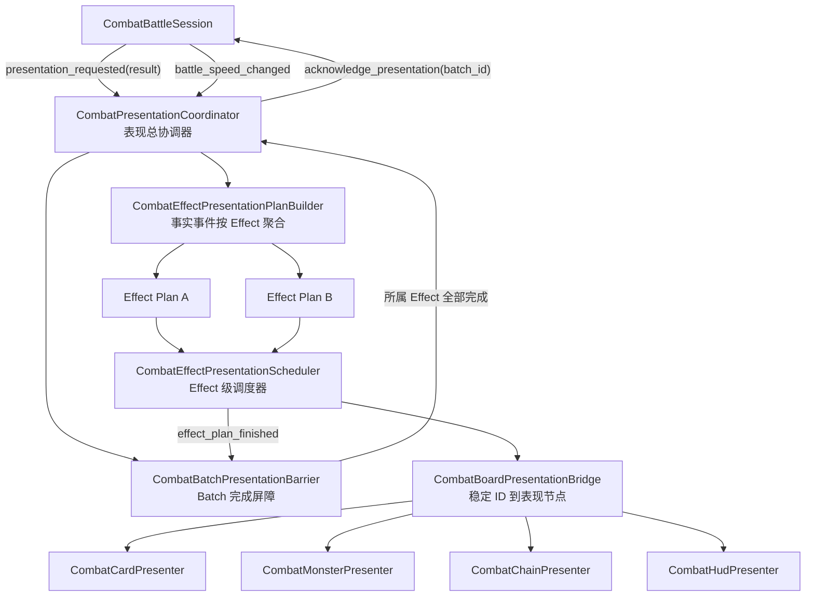

# 战斗表现与动画系统设计

日期：2026-08-15
状态：Effect 级动画边界已确认

## 1. 背景

新的战斗运行框架已经使用 `CombatBattleSession`、`CombatDriver`、`CombatLinearChainFlowProvider` 和 `CombatEffectBatchProcessor` 将自动流程、玩家操作与正式状态写入分离。玩家攻击和怪物攻击是两个独立批次；每个批次内部包含一个或多个 `CombatBatchEffect`，处理器提交后产生不可变的 `CombatStateEvent` 事实事件。

本设计在该框架上增加棋盘表现与动画子系统。表现层只解释已经提交的事实，不预测伤害、不修改正式状态，也不持有未来战斗流程。

本次修订明确：**动画不是按 Batch 执行，而是按 Effect 执行。** Batch 只保留状态事务、自动流程门控和最终表现确认的职责。

## 2. 已确认需求

1. 战斗过程必须由棋盘、棋盘上的卡牌、怪物和 HUD 向玩家展示。
2. 卡牌触发时保留抖动/抬起接口。
3. 点数、护盾、生命和金币变化保留数字动画接口。
4. 动画构建、依赖排序、资源锁、播放和完成都以 `CombatBatchEffect` 为单位，而不是以 `CombatEffectBatch` 为单位。
5. 玩家攻击批次与怪物攻击批次仍然分别提交；每个批次等待其所属 Effect 全部完成后分别确认。实际动画始终由各个 Effect 驱动，不新增包揽全部视觉结果的“玩家攻击表现事件”或“怪物攻击表现事件”。
6. 撤退、金币加盾以及未来其他操作卡可以在主战斗动画期间提交。
7. 操作批次立即结算并立即产生 Effect 表现请求，不强制中断当前主战斗动画。
8. 主战斗 Effect 与操作 Effect 允许并行；作用于同一实体的局部动画必须串行。
9. 战斗系统只接收已经构造完成的操作批次。拖拽、碰撞检测、目标预览/高亮、菜单和普通 UI 属于上层交互系统，本系统不定义对应动画接口。
10. 撤退 Effect 提交并产生已提交的 `chain_split` 事实后，表现层才播放真实拆链动画。
11. 战斗速度同时影响结算间隔和战斗动画。
12. 修改战斗速度时，正在播放的战斗动画立即变速。
13. 表现节点缺失、Tween 被取消、场景退出、空 Effect 或无效依赖都不能让战斗永久等待表现确认。

## 3. 不在本阶段范围内

1. 不替换 `EventInteractionController`。
2. 不替换旧 `CombatService2` 或旧遭遇入口。
3. 不同步写回 `CardInstance`。
4. 不迁移全部旧 `CardRule`。
5. 不制作最终美术动画、粒子、音效和 Shader 资源。
6. 不实现也不定义操作卡拖拽、碰撞检测、目标预览/高亮、菜单或普通 UI 接口；上层交互系统只向战斗会话提交操作批次。
7. 不让表现层重新计算伤害、死亡、反击或战斗结果。
8. 当前不把 Session/Driver 的表现确认接口改为 Effect 级确认；继续兼容 `acknowledge_presentation(batch_id)`。

## 4. 核心概念与职责边界

### 4.1 Batch、Effect、Clip

```text
Batch
    = 原子状态提交边界
    = 自动流程门控边界
    = acknowledge_presentation(batch_id) 的兼容确认边界

Effect
    = 动画构建边界
    = 动画依赖与排序边界
    = 调度、资源锁、播放和完成边界

Clip
    = 一个 Effect 内交给具体 Presenter 执行的最小动画动作
```

一个 Batch 可以包含零个或多个 Effect。每个 Effect 对应一个独立的 `CombatEffectPresentationPlan`；即使没有可见 Clip，也保留一个空 Plan 并安全完成。一个 Effect 可以产生零个或多个事实事件，也可以在自己的 Plan 中构建零个或多个 Clip。

**不可违反的边界：** `CombatEffectPresentationScheduler` 永远不接收 Batch 或 `CombatEffectBatchResult`，也不执行“整批动画”。只有 Coordinator 能看见 Batch Result；它负责拆出 Effect Plan 和创建 Batch 屏障，但不会把 Batch 交给动画执行器。

### 4.2 状态先提交，Effect 动画后解释

```text
CombatEffectBatchProcessor 原子提交 Batch
    -> 产生 CombatEffectBatchResult
    -> 按 batch_id + effect_id 聚合 CombatStateEvent
    -> 为每个 Effect 构建 CombatEffectPresentationPlan
    -> 调度并播放 Effect Plan
    -> BatchPresentationBarrier 聚合所属 Effect 的完成状态
    -> acknowledge_presentation(batch_id)
```

正式状态是唯一事实来源。动画失败不会回滚已经提交的 Batch 或 Effect。

### 4.3 Batch 生命周期事件不是动画执行单位

`PLAYER_ATTACK_STARTED`、`PLAYER_ATTACK_FINISHED`、`MONSTER_ATTACK_STARTED`、`MONSTER_ATTACK_FINISHED` 等没有 `effect_id` 的批次生命周期事件继续用于流程语义、诊断和批次确认，但不直接生成整批动画计划。

播放器不得通过 `result.batch_type` 选择并执行一套整批动画。具体动画必须由 Effect 的类型、标签和该 Effect 已提交的事实事件决定。

### 4.4 Effect 身份和顺序

Effect 的表现身份使用复合键：

```text
<batch_id>/<effect_id>
```

`effect_id` 必须在同一个 Batch 内非空且唯一。现有处理器已经校验非空；实施阶段补充批次内重复 ID 校验。

同一个 Effect 产生的事件都携带相同 `effect_id`。Effect 顺序按该组事件最小的 `CombatStateEvent.sequence` 升序确定。处理器逐个应用 Effect，因此同一 Batch 的 Effect 事件天然连续。

## 5. 总体架构



## 6. Effect 语义来源

### 6.1 使用现有 `CombatBatchEffect`

现有 Effect 协议已经包含：

```gdscript
var effect_id: String
var effect_type: StringName
var source_entity_id: String
var target_entity_ids: Array[String]
var parameters: Dictionary
var tags: Array[StringName]
```

表现层不需要复制或重新定义战斗 Effect。处理器需要在 `EFFECT_APPLIED` 事件中提供：

```gdscript
{
    "effect_type": effect.effect_type,
    "effect_tags": effect.tags.duplicate(),
}
```

### 6.2 动作标签

第一阶段定义最小动作语义标签：

```text
presentation/card_attack
presentation/monster_attack
presentation/card_trigger
```

- 玩家攻击 Damage Effect 带 `presentation/card_attack`；
- 怪物攻击 Damage Effect 带 `presentation/monster_attack`；
- 需要显示卡牌触发动作的 Effect 带 `presentation/card_trigger`；
- 撤退、金币变化、护盾变化等 Effect 可以只依赖自己的事实事件，不必带动作标签。

标签可以由战斗流程、卡牌规则或工厂在创建 Effect 时设置。**Plan Builder 只读取 Effect 标签，不根据 Batch 类型推导动作。**

## 7. 表现协议模型

### 7.1 `CombatPresentationClip`

描述一个 Effect 内的最小动画片段：

```gdscript
class_name CombatPresentationClip
extends RefCounted

var clip_id: String = ""
var clip_type: StringName = &""
var source_entity_id: String = ""
var target_entity_ids: Array[String] = []
var channel: StringName = &"main_battle"
var resource_locks: Array[StringName] = []
var start_after: Array[String] = []
var duration_weight: float = 1.0
var payload: Dictionary = {}
```

`start_after` 只引用同一个 Effect Plan 内的 `clip_id`。`resource_locks` 决定 Clip 能否与其他 Effect 的 Clip 并行。

### 7.2 `CombatEffectPresentationPlan`

```gdscript
class_name CombatEffectPresentationPlan
extends RefCounted

var batch_id: String = ""
var effect_id: String = ""
var effect_key: String = ""
var effect_type: StringName = &""
var effect_tags: Array[StringName] = []
var effect_sequence: int = -1
var source_entity_id: String = ""
var target_entity_ids: Array[String] = []
var channel: StringName = &"main_battle"
var starts_after_effect_keys: Array[String] = []
var requested_battle_speed: float = 1.0
var recommended_duration: float = 0.0
var clips: Array[CombatPresentationClip] = []
```

`effect_key` 固定为 `<batch_id>/<effect_id>`。`recommended_duration` 是 Batch 请求时已经按战斗速度缩放的现实时间预算；Builder 按 Effect 数量和 Clip 权重分配每个 Effect 的预算，不重新计算战斗速度。

### 7.3 `CombatBatchPresentationBarrier`

```gdscript
class_name CombatBatchPresentationBarrier
extends RefCounted

signal completed(batch_id: String)

func configure(batch_id: String, effect_keys: Array[String]) -> void
func mark_effect_finished(effect_key: String) -> void
func complete_empty_deferred() -> void
func cancel_and_complete() -> void
func is_completed() -> bool
```

屏障只负责聚合，不播放动画。重复完成、未知 Effect 或重复取消都必须幂等。

### 7.4 `CombatAnimationHandle`

Presenter 不向调度器暴露 Tween 或 AnimationPlayer，而是返回统一句柄：

```gdscript
class_name CombatAnimationHandle
extends RefCounted

signal finished()

func complete() -> void
func cancel(complete_immediately: bool = true) -> void
func set_speed_scale(speed_scale: float) -> void
func is_finished() -> bool
```

取消默认视为完成，防止表现确认死锁。

## 8. Effect 调度模型

### 8.1 Effect 级队列

调度器入口为：

```gdscript
func enqueue_effect_plan(plan: CombatEffectPresentationPlan) -> void
```

完成信号为：

```gdscript
signal effect_plan_finished(batch_id: String, effect_id: String, effect_key: String)
```

调度器不接收“整批动画计划”，也不根据 `batch_type` 选择动画。

### 8.2 同一 Batch 内的顺序

第一阶段采用确定性且保守的规则：

- 同一 Batch 的 Effect 按 `effect_sequence` 顺序播放；
- Builder 为后一个 Effect 添加前一个 Effect 的 `effect_key` 到 `starts_after_effect_keys`；
- Batch 内某个 Effect 没有可见 Clip 时也会安全完成，然后释放下一个 Effect；
- 将来若协议需要 Batch 内并行动画，可增加显式 Effect 依赖，而不是让 Scheduler 猜测。

### 8.3 跨 Batch 并行

不同 Batch 的 Effect 不自动互相依赖。主战斗 Effect 播放期间，新提交的玩家操作 Effect 可以立即入队。

真实并行能力仍由资源锁决定：

```text
entity:<stable_id>
board_chain_layout
hud:gold
hud:player_hp
hud:monster_hp
```

示例：

- 玩家攻击 Effect 占用攻击卡牌和怪物实体锁；
- 金币变化 Clip 只占用 `hud:gold`，可以立即播放；
- 同一操作 Effect 的护盾 Clip 等待 `entity:<target_card_id>`；
- 撤退拆链 Clip 等待 `board_chain_layout`；
- 作用于同一卡牌的主战斗和操作局部动画严格串行。

### 8.4 Clip 启动条件

一个 Clip 仅在以下条件全部满足时启动：

1. 所属 Effect 的 `starts_after_effect_keys` 已全部完成；
2. `start_after` 中的 Clip 已全部完成；
3. 所有 `resource_locks` 当前未被占用；
4. Effect Plan 没有被取消；
5. 调度器仍处于运行状态。

### 8.5 Effect Plan 完成条件

Effect Plan 中的所有 Clip 都满足以下任一条件：

- 正常完成；
- 因节点缺失被跳过；
- 因场景退出被取消并完成清理；
- 因无效 Clip 依赖被安全终止。

没有可见 Clip 的 Effect Plan 在下一帧完成，避免同步重入。

## 9. 事实事件按 Effect 聚合

### 9.1 聚合规则

Builder 只处理 `effect_id` 非空的事件，以 `(batch_id, effect_id)` 分组，并按每组最小 `sequence` 排序。

每组通过 `EFFECT_APPLIED` 获得 `effect_type` 和 `effect_tags`。生命周期事件、`BATCH_STARTED`、`BATCH_FINISHED` 等 `effect_id` 为空的事件不进入 Effect Plan。

构建入口：

```gdscript
func build_effect_plans(
    result: CombatEffectBatchResult,
    recommended_duration: float,
    requested_battle_speed: float
) -> Array[CombatEffectPresentationPlan]
```

### 9.2 伤害 Effect

同一个 Damage Effect 可能包含：

- `damage_applied`：伤害事实；
- `shield_changed`：护盾前后值；
- `health_changed` 或 `card_points_changed`：生命或点数前后值；
- `card_died` 或 `monster_died`：死亡事实；
- `effect_applied`：Effect 类型和标签。

Effect 内 Clip 顺序：

```text
动作标签对应的攻击/触发
    -> 目标受击
    -> 护盾变化
    -> 生命或点数变化
    -> 死亡
```

表现层只读取事件 `payload.before`、`payload.after` 等数据，不重新计算伤害，也不定义“有效伤害”。

### 9.3 直接修改护盾、点数或金币

没有 `damage_applied` 的 `shield_changed`、`card_points_changed`、`health_changed`、`gold_changed` 仍由各自所属 Effect 生成数字变化 Clip。

`gold_changed` 使用 `hud:gold` 锁，可以与目标卡牌的护盾动画并行；护盾 Clip 只受目标实体锁约束。

### 9.4 拆链 Effect

`chain_split` 事实生成：

```text
断开部分移出 -> 活动牌链重排
```

使用事件中的 `active_card_ids` 和 `detached_card_ids`，不从旧 `CardInstance` 推导结果，也不生成拖拽、目标预览或目标确认动画。

### 9.5 一个 Effect 的多目标

一个 Effect 可以影响多个目标。Builder 可以在同一个 Effect Plan 内为每个目标创建独立 Clip；不同目标的 Clip 在没有 `start_after` 且资源锁不冲突时可以并行。Effect 只有在所有目标 Clip 完成后才完成。

## 10. 战斗速度

`CombatBattleSession` 增加：

```gdscript
signal battle_speed_changed(speed: float)
func get_battle_speed() -> float
```

速度范围继续使用 `CombatBattleClock.MIN_SPEED = 0.05` 和 `MAX_SPEED = 16.0`。

每个运行 Clip 记录所属 Effect Plan 请求时的速度。例如请求时为 `2.0x`，当前改为 `4.0x`：

```text
handle.speed_scale = 4.0 / 2.0 = 2.0
```

新 Effect Plan 使用 Session 给出的 `recommended_duration` 所分配的预算，不再次除以当前速度。已排队但尚未启动的旧 Effect Plan 在启动时也应用 `current_speed / requested_battle_speed`。

拖拽、碰撞检测、目标预览/高亮、菜单和普通 UI 位于本系统之外，不连接战斗速度。

## 11. 棋盘表现桥和 Presenter

### 11.1 `CombatBoardPresentationBridge`

保存表现节点引用：

```gdscript
func register_card(card_id: String, presenter: CombatCardPresenter) -> void
func unregister_card(card_id: String) -> void
func get_card_presenter(card_id: String) -> CombatCardPresenter
func set_monster_presenter(presenter: CombatMonsterPresenter) -> void
func set_chain_presenter(presenter: CombatChainPresenter) -> void
func set_hud_presenter(presenter: CombatHudPresenter) -> void
func execute_clip(clip: CombatPresentationClip, duration: float) -> CombatAnimationHandle
```

稳定 ID 到 Node 的映射只存在于表现层，不进入任何战斗协议对象。

### 11.2 `CombatCardPresenter`

第一阶段提供占位动画：

- `card_trigger`：卡牌短促缩放或抖动；
- `card_attack`：向目标方向短移并归位；
- `card_hit`：闪烁或轻微震动；
- `card_points_change`：数字更新；
- `card_shield_change`：护盾数字更新；
- `card_death`：缩小并淡出。

Presenter 只更新显示，不写 `CardInstance`。

### 11.3 其他 Presenter

- `CombatMonsterPresenter`：攻击、受击、护盾、生命、死亡。
- `CombatChainPresenter`：拆链和布局重排。
- `CombatHudPresenter`：金币和玩家生命。

## 12. Batch 表现屏障与玩家操作

`CombatDriver` 在等待表现确认时仍然允许处理器执行已经提交的玩家操作，因此可能同时存在多个待确认 Batch 和更多正在执行的 Effect Plan。

协调器处理一个 committed Result 时：

1. 创建该 `batch_id` 的 `CombatBatchPresentationBarrier`；
2. 构建并登记全部 Effect Plan；
3. 把 Effect Plan 逐个交给 Scheduler；
4. 每个 `effect_plan_finished` 只完成屏障中的一个 Effect；
5. 屏障全部完成后只调用一次 `session.acknowledge_presentation(batch_id)`。

示例：

```text
玩家攻击 Batch
    Damage Effect 正在播放

同时提交金币加盾 Batch
    SpendGold Effect -> hud:gold，可并行
    ModifyShield Effect -> entity:card_a，等待实体锁

同时提交撤退 Batch
    SplitChain Effect -> board_chain_layout，按锁等待
```

只有 Driver 的待确认 Batch 集合为空，自动战斗流程才继续生成怪物攻击或下一轮玩家攻击。

## 13. 错误与生命周期

1. 找不到目标 Presenter：警告、跳过 Clip、释放锁并推进所属 Effect。
2. Presenter 在播放中退出树：句柄取消并完成。
3. Tween 被替换或停止：句柄必须完成一次。
4. 重复完成句柄或 Effect Plan：忽略后续完成。
5. Batch 内重复 `effect_id`：处理器拒绝该 Batch，避免表现身份冲突。
6. Effect 内 Clip 存在循环依赖：安全终止该 Effect，输出包含 `effect_key` 的错误。
7. Effect 间依赖存在循环：安全终止相关 Effect，并让 Batch 屏障最终完成。
8. 空 Effect、无可见 Clip 或只有生命周期事件的 Batch：下一帧完成对应 Effect 或空屏障。
9. 重复确认 Batch：屏障和协调器都保证最多调用一次。
10. 场景退出：先停止 Session/Driver，再取消 Scheduler 中的 Effect Plan，最后让全部屏障完成并清空表现桥。

## 14. 测试策略

### 14.1 协议测试

- Batch 内 `effect_id` 必须非空且唯一；
- `EFFECT_APPLIED` 携带 `effect_type` 和 `effect_tags`；
- 同一 Effect 的事实事件具有相同 `effect_id`；
- Effect 复合键使用 `batch_id/effect_id`。

### 14.2 Builder 测试

- 一个含多个 Effect 的 Result 生成多个 Effect Plan；
- Effect Plan 顺序按事件最小 `sequence`；
- `batch_type` 不决定攻击、触发或操作动画；
- Effect 标签决定 `card_attack`、`monster_attack` 和 `card_trigger`；
- 同一 Damage Effect 不重复生成伤害数字动画；
- 护盾、点数、生命和死亡 Clip 顺序正确；
- 操作 Effect 不生成拖拽、目标预览或目标确认 Clip；
- 撤退只使用已经提交的拆链事实。

### 14.3 Scheduler 测试

- 同一 Batch 的 Effect 默认通过 `starts_after_effect_keys` 建立 Effect 间顺序；Scheduler 执行的仍是独立 Effect Plan，而不是 Batch；
- 不同 Batch 且资源不冲突的 Effect 并行；
- 同实体锁串行；
- 一个 Effect 内的 Clip 依赖正确；
- 多目标 Clip 可在无冲突时并行；
- 空 Effect Plan 下一帧完成；
- 缺失节点不死锁；
- 中途变速立即传给活动句柄。

### 14.4 Barrier 与 Session 集成测试

- 一个 Batch 的多个 Effect 分别完成后才确认一次 Batch；
- 一个 Effect 完成不会提前确认所属 Batch；
- 玩家攻击 Effect 播放中可提交金币加盾或撤退操作 Effect；
- 操作 Effect 完成前不生成下一自动攻击 Batch；
- 撤退拆掉当前卡牌后不表现对旧目标的怪物攻击；
- 空 Batch 和无可见 Effect 不阻塞 Driver；
- 战斗速度同时影响结算与活动动画。

## 15. 分阶段交付

1. 补强 Effect 身份协议和动作标签事实。
2. Effect 表现协议模型、Batch 屏障和统一动画句柄。
3. Effect 级依赖与资源锁调度器。
4. 事实事件按 Effect 聚合与 Plan Builder。
5. 棋盘表现桥及 Presenter 接口。
6. 卡牌、怪物、牌链和 HUD 占位动画。
7. Session 速度信号和表现总协调器。
8. 操作卡并行表现与完整集成测试。

每一阶段必须具备独立测试，不等待最终美术资源完成。
