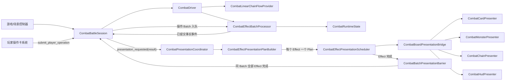
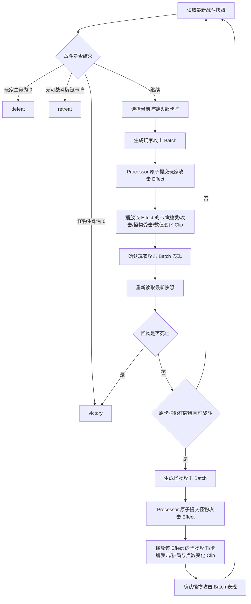

# 新版战斗框架

本目录存放新的批次驱动战斗框架，与 `scripts/combatv2/` 中的旧版战斗系统物理隔离。

当前阶段提供可运行的惰性线性牌链战斗、玩家操作 Batch、按 Effect 调度的棋盘表现框架，以及统一的战斗速度控制；尚未替换旧遭遇入口。

## 核心原则

1. **状态按 Batch 原子提交**：一个 Batch 中的所有 Effect 要么全部通过验证并提交，要么不写入正式状态。
2. **动画按 Effect 执行**：不存在“按 Batch 播放一段综合动画”的接口。每个已提交 Effect 都会生成独立的 `CombatEffectPresentationPlan`。
3. **Batch Barrier 只负责最终确认**：同一 Batch 的全部 Effect Plan 完成后，才向 `CombatBattleSession` 确认该 Batch 的表现已经结束。
4. **自动流程是惰性的**：`CombatLinearChainFlowProvider` 每次只根据最新快照生成下一个自动 Batch，不缓存整场战斗的未来伤害。
5. **玩家攻击和怪物攻击分离**：两者是独立 Batch、独立 Effect、独立表现请求和独立确认边界。
6. **处理器是唯一正式状态写入者**：Session、Driver、Flow、Presenter 都不能直接修改 `CombatRuntimeState`。
7. **战斗速度同时控制结算和表现**：它既缩放 Driver 的批次间隔，也缩放排队中及正在播放的战斗动画。

## 目录职责

- `protocol/`：Effect、Batch、事件、条件、验证结果和战斗结果协议。
- `state/`：运行状态、只读快照、Batch 草稿和受控状态写入器。
- `batch/`：Batch 队列、Effect Handler 注册表和唯一状态提交处理器。
- `effects/`：标准 Effect 类型、Effect Handler 和死亡等状态规则。
- `runtime/`：战斗时钟、Driver、Flow Provider、触发规划器和顶层 Session。
- `presentation/`：由事实事件构建 Effect Plan、调度 Clip、资源锁和 Batch Barrier。
- `presentation/presenters/`：棋盘卡牌、怪物、牌链和 HUD 的表现接口及基础 Tween 占位实现。

## 总体架构



### Batch 与 Effect 的职责边界

```text
CombatEffectBatch
├── 验证前置条件
├── 按顺序应用 Effect 到草稿状态
├── 原子提交正式状态
├── 产生带 effect_id 的事实事件
└── 等待该 Batch 下所有 Effect 表现完成后确认

CombatEffectPresentationPlan（每个 Effect 一个）
├── Effect 间依赖 starts_after_effect_keys
├── 多个 CombatPresentationClip
├── Clip 内依赖 start_after
├── 局部资源锁 resource_locks
└── 独立完成信号
```

因此：**Batch 是状态事务和自动流程门控边界，Effect 才是战斗动画执行单位。**

## 惰性战斗流程

牌链存储顺序保持“根部到头部”，默认从头部向根部选择当前战斗卡牌。



基础流程规则：

- 玩家攻击力取该卡牌本轮开始时的 `points`。
- 怪物反击力取玩家攻击前的怪物生命值，并暂存在流程游标中。
- 玩家攻击和怪物攻击之间重新读取状态；此时提交的加盾操作会真实影响怪物攻击结算。
- 伤害优先扣除护盾，再扣除点数或生命。
- 当前卡牌没有死亡且仍在牌链中时，下一轮可以继续使用它。
- 当前卡牌死亡或被操作拆离牌链后，下一次惰性判定重新选择目标。
- 不预先缓存后续攻击 Batch，也不缓存整场战斗的未来伤害。

## 游戏层组装

建议由战斗场景控制器长期持有 Session、Bridge、Builder、Scheduler 和 Coordinator：

```gdscript
extends Node

var session: CombatBattleSession
var bridge: CombatBoardPresentationBridge
var builder: CombatEffectPresentationPlanBuilder
var scheduler: CombatEffectPresentationScheduler
var coordinator: CombatPresentationCoordinator

@onready var card_presenter: CombatCardPresenter = %CardPresenter
@onready var monster_presenter: CombatMonsterPresenter = %MonsterPresenter
@onready var chain_presenter: CombatChainPresenter = %ChainPresenter
@onready var hud_presenter: CombatHudPresenter = %HudPresenter


func setup_battle(initial_state: Dictionary) -> void:
    session = CombatBattleSession.new(initial_state)
    session.driver.require_presentation_acknowledgement = true

    bridge = CombatBoardPresentationBridge.new()
    add_child(bridge)
    bridge.register_card("card_a", card_presenter)
    bridge.register_monster("monster", monster_presenter)
    bridge.set_chain_presenter(chain_presenter)
    bridge.set_hud_presenter(hud_presenter)

    builder = CombatEffectPresentationPlanBuilder.new()
    scheduler = CombatEffectPresentationScheduler.new(bridge)
    coordinator = CombatPresentationCoordinator.new()
    coordinator.configure(session, builder, scheduler)

    session.set_battle_speed(2.0)
    session.start()


func _process(delta: float) -> void:
    if session != null:
        session.advance(delta)


func _exit_tree() -> void:
    if coordinator != null:
        coordinator.shutdown()
```

稳定实体 ID 必须同时存在于战斗状态和表现注册表中。例如状态中的 `card_a` 必须注册到对应的 `CombatCardPresenter`；缺少 Presenter 时 Bridge 会返回安全完成句柄，避免 Driver 永久等待。

## 提交玩家操作卡

操作卡系统负责完成拖拽、碰撞、目标判定和 Batch 构建；战斗系统只接收已经构建好的操作 Batch：

```gdscript
func submit_operation(operation_batch: CombatEffectBatch) -> bool:
    var accepted := session.submit_player_operation(operation_batch)
    if accepted:
        # 下一次 advance（允许 delta 为 0）会优先处理已经入队的玩家操作。
        session.advance(0.0)
    return accepted
```

### 撤退操作

```gdscript
var snapshot := session.create_snapshot()
var retreat_batch := CombatOperationBatchFactory.create_retreat_batch(
    "operation:retreat:001",
    "retreat_card",
    target_card_id,
    snapshot.chain_revision
)
session.submit_player_operation(retreat_batch)
```

撤退协议只通过 `metadata.target_card_id` 暴露目标信息。战斗表现模块不提供拖拽预览动画；只有正式 Batch 提交并产生 `CHAIN_SPLIT` 事实后，Builder 才生成真实的 `CHAIN_SPLIT` 和 `CHAIN_REFLOW` Clip。

### 消耗金币增加护盾

```gdscript
var snapshot := session.create_snapshot()
var shield_batch := CombatOperationBatchFactory.create_gold_shield_batch(
    "operation:shield:001",
    "forge_card",
    target_card_id,
    2, # 金币消耗
    3, # 护盾增加量
    snapshot.chain_revision
)
session.submit_player_operation(shield_batch)
```

操作 Batch 可以在主战斗 Effect 正在播放时入队，并在下一次 `advance()` 优先结算，不需要中断主战斗动画。操作 Effect 的表现请求会立即进入 Scheduler：

- 不同 Effect 没有依赖且资源锁不冲突时可以并行；
- 同一实体的点数、护盾、受击等局部动画通过资源锁串行；
- 同一 Batch 内由 Builder 声明的 Effect 依赖仍按顺序执行；
- 操作 Batch 与自动攻击 Batch 各自拥有独立的 Batch Barrier；
- Driver 会等待所有尚未确认的自动/操作 Batch，但该门控不阻止继续提交新的玩家操作 Batch。

## 战斗速度

统一通过 Session 修改战斗速度：

```gdscript
session.set_battle_speed(4.0)
var current_speed := session.get_battle_speed()
```

战斗速度影响：

- `CombatDriver` 的自动 Batch 结算间隔；
- 新进入队列的战斗 Effect 动画时长；
- 正在播放的 `CombatAnimationHandle`，修改后立即变速；
- 已排队但尚未启动的 Effect/Clip，启动时使用最新战斗速度。

表现确认只阻止自动流程生成下一个 Batch，**不会暂停战斗时钟本身**。如果等待表现期间逻辑间隔已经到期，所有 Batch Barrier 解除后的下一次 `advance()` 可以立即生成下一个自动 Batch。

以下交互不属于战斗表现模块，也不应连接 `battle_speed_changed`：

- 拖拽；
- 碰撞检测；
- 目标预览和目标高亮；
- 菜单；
- 普通 UI 输入与动画。

## 表现容错与场景生命周期

- Presenter 缺失时，Bridge 返回安全完成句柄。
- Tween 被取消或 Presenter 节点退出场景时，`CombatAnimationHandle` 必须结束，不能永久占用资源锁。
- 空 Effect Plan 会延迟完成并释放 Batch Barrier。
- Effect 依赖循环或 Clip 依赖死锁会报错并安全结束相关 Effect。
- 场景退出、重新加载战斗或替换 Session 前必须调用 `coordinator.shutdown()`；它会取消 Scheduler 中的动画并完成剩余 Barrier，避免 Driver 永久等待表现确认。

## 当前阶段边界

当前不做以下接入：

- 不替换 `EventInteractionController`；
- 不替换旧 `CombatService2`；
- 不同步写回旧 `CardInstance`；
- 不迁移全部旧 `CardRule`；
- 不实现拖拽、碰撞检测、目标预览或目标高亮；
- 不负责菜单和普通 UI；
- Presenter 中的 Tween 仅为基础占位，后续可在保持 Effect/Clip 协议不变的前提下替换具体动画。
